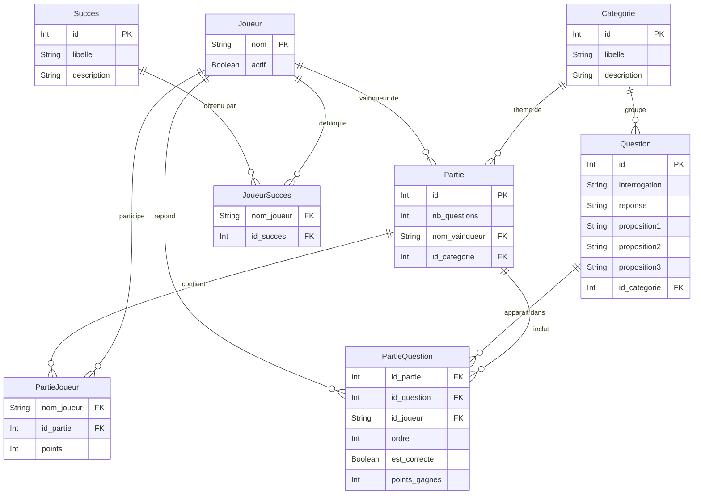

# Quiz App 🎯

Application de quiz multijoueur développée dans le cadre du cours de projet de développement SGBD (BAC 2).
Elle permet de gérer des joueurs, des catégories, des questions et des parties de quiz, avec un système de succès.

Développée avec **Electron** (desktop), **Angular** (interface), **Prisma** (ORM) et **SQLite** (base de données locale).

---

## Table des matières

1. [Description du projet](#description-du-projet)
2. [Schéma de la base de données](#schéma-de-la-base-de-données)
3. [Explication de la modélisation](#explication-de-la-modélisation)
4. [Prérequis](#prérequis)
5. [Installation](#installation)
6. [Scripts disponibles](#scripts-disponibles)
7. [Structure du projet](#structure-du-projet)

---

## Description du projet

QuizzCulture est une application de bureau qui permet de :

- **Gérer des joueurs** : créer, consulter et supprimer des joueurs (suppression logique via `actif`)
- **Gérer des catégories** : organiser les questions par thème
- **Gérer des questions** : créer des questions à choix multiples (1 bonne réponse + 3 propositions)
- **Jouer des parties** : lancer des parties multijoueur, attribuer des questions aux joueurs, suivre les scores avec trois modes de réponse (Cash, Carré, Duo)
- **Débloquer des succès** : système de récompenses automatiques pour les joueurs

L'application suit une architecture **Main / Preload / Renderer** imposée par Electron, avec communication via IPC entre le process principal (Node.js + Prisma) et le renderer (Angular).

---

## Schéma de la base de données



### Tables

| Table | Clé primaire | Description |
|---|---|---|
| `Joueur` | `nom` (String) | Un joueur identifié par son nom. Champ `actif` pour la suppression logique. |
| `Succes` | `id` (autoincrement) | Récompense débloquable par un joueur. |
| `Categorie` | `id` (autoincrement) | Thème regroupant des questions. |
| `Question` | `id` (autoincrement) | Question à choix multiples avec 1 bonne réponse et 3 propositions. Appartient à une catégorie. |
| `Partie` | `id` (autoincrement) | Session de jeu. Contient le nombre de questions, le vainqueur (nullable) et la catégorie (nullable — null = mode mixte). |
| `PartieJoueur` | `(nom_joueur, id_partie)` | Table de jonction N:M entre Joueur et Partie. Stocke les points du joueur dans la partie. |
| `PartieQuestion` | `(id_partie, id_question)` | Table de jonction N:M entre Partie et Question. Stocke le joueur répondant, l'ordre, si la réponse était correcte et les points gagnés. |
| `JoueurSucces` | `(nom_joueur, id_succes)` | Table de jonction N:M entre Joueur et Succès. |

---

## Explication de la modélisation

### Les entités principales

**Joueur**
Identifié par son nom (clé primaire naturelle). Le champ `actif` (booléen, `true` par défaut) permet une suppression logique : un joueur supprimé conserve tout son historique et peut être réactivé.

**Question**
Question à choix multiples avec l'énoncé, la bonne réponse et trois propositions incorrectes. Chaque question appartient à une catégorie (relation 1:N).

**Categorie**
Regroupe les questions par thème (ex : Histoire, Science, Sport, Géographie, Musique).

**Succes**
Récompense débloquable automatiquement en fin de partie (ex : "Première victoire", "Sans faute"...).

**Partie**
Représente une session de jeu. Elle contient le nombre de questions jouées, le nom du vainqueur (nullable — la partie peut être en cours) et la catégorie choisie (nullable — `null` signifie mode mixte toutes catégories).

### Les relations

**PartieJoueur** — Table de jonction N:M entre Joueur et Partie

Un joueur peut participer à plusieurs parties, et une partie peut avoir plusieurs joueurs.
Cette table stocke également les **points** obtenus par chaque joueur dans chaque partie.

**PartieQuestion** — Table de jonction N:M entre Partie et Question

Une partie contient plusieurs questions, et une question peut apparaître dans plusieurs parties.
Cette table stocke quel joueur a répondu (`id_joueur`, nullable), l'**ordre** d'apparition, si la réponse était **correcte** (`est_correcte`, nullable) et les **points gagnés** (`points_gagnes`, nullable).

**JoueurSucces** — Table de jonction N:M entre Joueur et Succès

Un joueur peut débloquer plusieurs succès, et un succès peut être débloqué par plusieurs joueurs.

### Choix de modélisation

| Choix | Justification |
|---|---|
| `nom` comme PK pour Joueur | Le nom est l'identifiant naturel d'un joueur dans ce contexte |
| `actif` sur Joueur | Suppression logique : préserve l'historique des parties et des succès |
| `nom_vainqueur` nullable dans Partie | La partie peut être en cours sans vainqueur encore désigné |
| `id_categorie` nullable dans Partie | `null` = mode mixte (questions de toutes catégories) |
| `id_joueur` nullable dans PartieQuestion | Une question peut être posée sans qu'un joueur y ait encore répondu |
| `est_correcte` et `points_gagnes` dans PartieQuestion | Traçabilité complète de chaque réponse pour les statistiques |
| Tables de jonction explicites | Permet de stocker des données supplémentaires sur la relation (points, ordre, résultat) |
| `onDelete: Cascade` sur PartieJoueur et PartieQuestion | Supprimer une partie supprime automatiquement ses joueurs et ses questions associées |
| `autoincrement` sur les IDs numériques | Garantit l'unicité sans contrainte métier |

---

## Prérequis

Avant de commencer, assurez-vous d'avoir installé :

- [Node.js](https://nodejs.org/) v18 ou supérieur
- [Git](https://git-scm.com/)
- Angular CLI : `npm install -g @angular/cli`
- **Windows uniquement** : [Visual Studio Build Tools 2022](https://visualstudio.microsoft.com/downloads/#build-tools-for-visual-studio-2022) avec le composant "Développement Desktop en C++"

> Les Visual Studio Build Tools sont obligatoires sur Windows pour compiler `better-sqlite3`, un module natif C++ requis par Prisma.

---

## Installation

### 1. Extraire le zip et se placer dans le dossier

```bash
cd QuizzCulture
```

### 2. Installer les dépendances Electron

```bash
npm install
```

### 3. Créer le fichier d'environnement

Créez un fichier `.env` à la racine du projet avec le contenu suivant :

```
DATABASE_URL="file:./dev.db"
```

> Ce fichier est ignoré par Git (`.gitignore`), il doit donc être recréé manuellement sur chaque machine.

### 4. Générer le client Prisma et créer la base de données

```bash
npx prisma migrate deploy
npx prisma generate
```

`prisma migrate deploy` applique les migrations existantes et crée le fichier `dev.db`.
`prisma generate` génère le client TypeScript dans `src/prisma/generated/`.

### 5. Peupler la base de données (seed)

La seed s'exécute via `ts-node` (Node.js système). Il faut d'abord recompiler `better-sqlite3` pour Node.js, faire la seed, puis le recompiler pour Electron.

```bash
npm rebuild better-sqlite3
npx prisma db seed
```

> Cette commande insère les données de test : catégories, questions (500+), succès. Défini dans `prisma/seed.ts`.

### 6. Recompiler better-sqlite3 pour Electron

Après la seed, recompilez `better-sqlite3` pour Electron afin que l'application puisse démarrer correctement.

```bash
npm install --save-dev @electron/rebuild
npx electron-rebuild -f -w better-sqlite3
```

### 7. Installer les dépendances Angular et builder le renderer

```bash
cd renderer/app
npm install
ng build
cd ../..
```

### 8. Lancer l'application

```bash
npm start
```

L'application Electron s'ouvre.

> ⚠️ **Important** : si vous relancez `npx prisma db seed` après coup, vous devrez refaire l'étape 6 (`electron-rebuild`) avant de relancer `npm start`.

---

## Scripts disponibles

| Script | Commande | Description |
|---|---|---|
| `npm start` | `electron-forge start` | Lance l'application Electron |
| `npm run build:angular` | `cd renderer/app && ng build` | Compile le renderer Angular |
| `npm run prisma:migrate` | `prisma migrate dev` | Crée et applique une nouvelle migration |
| `npm run prisma:generate` | `prisma generate` | Régénère le client TypeScript Prisma |
| `npm run prisma:studio` | `prisma studio` | Ouvre l'interface visuelle de la base de données |

---

## Structure du projet

```
QuizzCulture/
├── src/
│   ├── main/
│   │   └── main.ts              # Process principal Electron (IPC handlers)
│   ├── preload/
│   │   └── preload.ts           # Bridge sécurisé via contextBridge
│   ├── ipc/
│   │   └── handlers.ts          # Handlers IPC Prisma
│   └── prisma/
│       └── generated/           # Client Prisma généré (ignoré par git)
├── renderer/
│   └── app/                     # Application Angular
│       ├── src/
│       │   └── app/
│       │       ├── components/  # Composants Angular
│       │       ├── services/    # Services Angular
│       │       └── types/       # Types TypeScript
│       └── dist/                # Build Angular (ignoré par git)
├── prisma/
│   ├── schema.prisma            # Schéma de la base de données
│   ├── seed.ts                  # Script de peuplement des données de test
│   └── migrations/              # Migrations SQL versionnées
├── .env                         # Variables d'environnement (à créer manuellement, non versionné)
├── forge.config.ts              # Configuration Electron Forge
├── prisma.config.ts             # Configuration Prisma
├── vite.main.config.mts         # Configuration Vite (main process)
├── vite.preload.config.mts      # Configuration Vite (preload)
└── README.md
```