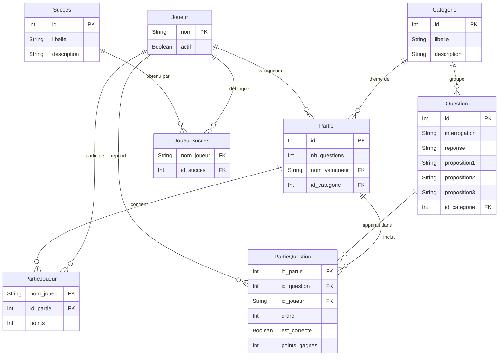

# QuizzCulture 🎯

Application de quiz multijoueur développée dans le cadre du cours de projet de développement SGBD (BAC 2).
Elle permet de gérer des joueurs, des catégories, des questions et des parties de quiz, avec un système de succès.

Développée avec **Electron** (desktop), **Angular** (interface), **Prisma** (ORM) et **SQLite** (base de données locale).

---

## Table des matières

1. [Description du projet](#description-du-projet)
2. [Schéma de la base de données](#schéma-de-la-base-de-données)
3. [Explication de la modélisation](#explication-de-la-modélisation)
4. [Installation](#installation)
5. [Scripts disponibles](#scripts-disponibles)
6. [Structure du projet](#structure-du-projet)

---

## Description du projet

QuizzCulture est une application de bureau qui permet de :

- **Gérer des joueurs** : créer, consulter et supprimer des joueurs (suppression logique via `actif`)
- **Gérer des catégories** : organiser les questions par thème
- **Gérer des questions** : créer des questions à choix multiples (1 bonne réponse + 3 propositions)
- **Jouer des parties** : lancer des parties multijoueur, attribuer des questions aux joueurs, suivre les scores avec trois modes de réponse (Cash, Carré, Duo)
- **Débloquer des succès** : système de récompenses automatiques pour les joueurs

L'application suit une architecture **Main / Preload / Renderer** imposée par Electron, avec communication via IPC entre le process principal (Node.js + Prisma) et le renderer (Angular).

---

## Schéma de la base de données



---

## Explication de la modélisation

### Les tables

| Table | Clé primaire | Description |
|---|---|---|
| `Joueur` | `nom` (String) | Un joueur identifié par son nom. Champ `actif` pour la suppression logique. |
| `Succes` | `id` (autoincrement) | Récompense débloquable par un joueur. |
| `Categorie` | `id` (autoincrement) | Thème regroupant des questions. |
| `Question` | `id` (autoincrement) | Question à choix multiples avec 1 bonne réponse et 3 propositions. Appartient à une catégorie. |
| `Partie` | `id` (autoincrement) | Session de jeu. Contient le nombre de questions, le vainqueur (nullable) et la catégorie (nullable — null = mode mixte). |
| `PartieJoueur` | `(nom_joueur, id_partie)` | Table de jonction N:M entre `Joueur` et `Partie`. Stocke les points du joueur dans la partie. |
| `PartieQuestion` | `(id_partie, id_question)` | Table de jonction N:M entre `Partie` et `Question`. Stocke le joueur répondant, l'ordre, la correction et les points gagnés. |
| `JoueurSucces` | `(nom_joueur, id_succes)` | Table de jonction N:M entre `Joueur` et `Succes`. |

### Les relations

**Categorie → Question** (1:N)
Une catégorie regroupe plusieurs questions. Chaque question appartient à exactement une catégorie. Implémentée via une clé étrangère `id_categorie` dans `Question`, avec `onDelete: Restrict` (on ne peut pas supprimer une catégorie qui contient des questions).

**Categorie → Partie** (1:N)
Une partie peut être liée à une catégorie (mode thématique) ou non (`null` = mode mixte toutes catégories). Relation optionnelle via `id_categorie` nullable dans `Partie`.

**Joueur → Partie** (1:N — vainqueur)
La `Partie` garde une référence vers le nom du vainqueur, nullable tant que la partie est en cours.

**Joueur ↔ Partie** (N:M via `PartieJoueur`)
Un joueur peut participer à plusieurs parties, et une partie peut avoir plusieurs joueurs. La table de jonction `PartieJoueur` stocke également les `points` accumulés par chaque joueur dans chaque partie — données impossibles à placer dans l'une ou l'autre table principale. `onDelete: Cascade` sur la `Partie` : supprimer une partie supprime automatiquement ses entrées `PartieJoueur`.

**Partie ↔ Question** (N:M via `PartieQuestion`)
Une partie contient plusieurs questions, et une même question peut apparaître dans plusieurs parties. La table `PartieQuestion` stocke l'`ordre` d'apparition de la question, quel joueur y a répondu (`id_joueur`, nullable au moment de la création), si la réponse était correcte (`est_correcte`) et les `points_gagnes`. `onDelete: Cascade` sur la `Partie` : supprimer une partie supprime automatiquement ses entrées `PartieQuestion`.

**Joueur ↔ Succes** (N:M via `JoueurSucces`)
Un joueur peut débloquer plusieurs succès, et un même succès peut être débloqué par plusieurs joueurs. La table de jonction ne stocke ici que la relation elle-même (pas de données supplémentaires).

### Choix de modélisation

| Choix | Justification |
|---|---|
| `nom` comme clé primaire pour `Joueur` | Le nom est l'identifiant naturel et métier d'un joueur. Évite une clé technique superflue. |
| Champ `actif` sur `Joueur` | Suppression logique : préserve tout l'historique des parties et des succès liés au joueur. |
| `nom_vainqueur` nullable dans `Partie` | La partie peut exister sans vainqueur encore désigné (partie en cours). |
| `id_categorie` nullable dans `Partie` | `null` représente le mode mixte (questions piochées dans toutes les catégories). |
| `id_joueur` nullable dans `PartieQuestion` | La question est pré-insérée au lancement de la partie ; le joueur répondant est renseigné en cours de partie. |
| `est_correcte` et `points_gagnes` dans `PartieQuestion` | Permet la traçabilité complète de chaque réponse pour l'affichage du détail d'une partie dans l'historique. |
| Tables de jonction explicites avec `@@id` composite | Permet de stocker des données supplémentaires sur les relations (points, ordre, résultat) — impossible avec une relation implicite Prisma. |
| `onDelete: Cascade` sur `PartieJoueur` et `PartieQuestion` | Supprimer une partie nettoie automatiquement ses données liées. |
| `onDelete: Restrict` sur `Question → Categorie` | Interdit la suppression d'une catégorie si elle contient encore des questions. |
| `autoincrement` sur les IDs numériques | Garantit l'unicité sans contrainte métier supplémentaire. |

---

## Installation

> On part du principe que Node.js, Angular CLI et Git sont déjà installés sur la machine.

### 1. Cloner le dépôt et se placer dans le dossier

```bash
git clone <url-du-repo>
cd QuizzCulture
```

### 2. Créer le fichier d'environnement

Créez un fichier `.env` à la racine du projet avec le contenu suivant :

```
DATABASE_URL="file:./dev.db"
```

> Ce fichier est ignoré par Git (`.gitignore`), il doit être recréé manuellement sur chaque machine.

### 3. Installer les dépendances Electron

```bash
npm install
```

### 4. Générer le client Prisma et créer la base de données

```bash
npx prisma migrate deploy
npx prisma generate
```

`prisma migrate deploy` applique les migrations existantes et crée le fichier `dev.db`.  
`prisma generate` génère le client TypeScript dans `src/prisma/generated/`.

### 5. Peupler la base de données (seed)

```bash
npx prisma db seed
```

Le seed insère les catégories, les questions et les succès nécessaires au bon fonctionnement de l'application.

### 6. Recompiler le module natif better-sqlite3 pour Electron

```bash
npm install --save-dev @electron/rebuild
npx electron-rebuild -f -w better-sqlite3
```

### 7. Installer les dépendances Angular et builder le renderer

```bash
cd renderer/app
npm install
ng build
cd ../..
```

### 8. Lancer l'application

```bash
npm start
```

L'application Electron s'ouvre.

> ⚠️ **Important** : si vous relancez `npx prisma db seed` après coup, vous devrez refaire l'étape 6 (`electron-rebuild`) avant de relancer `npm start`.

---

## Scripts disponibles

| Script | Commande | Description |
|---|---|---|
| `npm start` | `electron-forge start` | Lance l'application Electron |
| `npm run build:angular` | `cd renderer/app && ng build` | Compile le renderer Angular |
| `npm run prisma:migrate` | `prisma migrate dev` | Crée et applique une nouvelle migration |
| `npm run prisma:generate` | `prisma generate` | Régénère le client TypeScript Prisma |
| `npm run prisma:studio` | `prisma studio` | Ouvre l'interface visuelle de la base de données |

---

## Structure du projet

```
QuizzCulture/
├── src/
│   ├── main/
│   │   └── main.ts              # Process principal Electron (IPC handlers)
│   ├── preload/
│   │   └── preload.ts           # Bridge sécurisé via contextBridge
│   ├── ipc/
│   │   └── handlers.ts          # Handlers IPC Prisma
│   └── prisma/
│       └── generated/           # Client Prisma généré (ignoré par git)
├── renderer/
│   └── app/                     # Application Angular
│       ├── src/
│       │   └── app/
│       │       ├── components/  # Composants Angular
│       │       ├── services/    # Services Angular
│       │       └── types/       # Types TypeScript
│       └── dist/                # Build Angular (ignoré par git)
├── prisma/
│   ├── schema.prisma            # Schéma de la base de données
│   ├── seed.ts                  # Script de peuplement des données de test
│   └── migrations/              # Migrations SQL versionnées
├── .env                         # Variables d'environnement (à créer manuellement, non versionné)
├── forge.config.ts              # Configuration Electron Forge
├── prisma.config.ts             # Configuration Prisma
├── vite.main.config.mts         # Configuration Vite (main process)
├── vite.preload.config.mts      # Configuration Vite (preload)
└── README.md
```